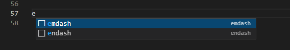

---
---

# En and em dash in VSCode

It turns out we can add some convenient [snippets](https://code.visualstudio.com/docs/editor/userdefinedsnippets#_create-your-own-snippets) for **en dash** and **em dash** in VSCode.

First we need to create a global snippet file by following the steps below:

- Open up the **Command Palette** (`Ctrl+Shift+P`)
- type _user snippets_
- choose **Preferences: Configure User Snippets**
- choose **New Global Snippets file...**
- enter the name for the global snippet json (here I'll use `global.code-snippets.json`)

And then create the following key-values inside the json.

```json title="global.code-snippets.json"
{
  "endash": {
    "prefix": "endash",
    "body": "–"
  },
  "emdash": {
    "prefix": "emdash",
    "body": "—"
  }
}
```

**prefix** is a trigger word for **body**. So every time you type the prefix for a snippet (or substring of it), [intelliSense](https://code.visualstudio.com/docs/editor/intellisense) will show you the snippet name; for example, `endash` or `emdash` above.

IntelliSense can be triggered by `Ctrl+Space` in any editor window.

:::tip
By default, quick suggestion is disabled for **markdown** language in vscode, which means you have to manually trigger intelliSense with `Ctrl+Space` everytime you want to use your snippets; you can verify this in **defaultSettings.json**.

We can change this behavior by overriding the default behavior in our **settings.json** like below.

```json title="settings.json"
{
  ...
  "[markdown]": {
  ...
  // Controls whether suggestions should automatically show up while typing.
  "editor.quickSuggestions": true,
  // Controls whether completions should be computed based on words in the document.
  "editor.wordBasedSuggestions": false,
  // Controls whether suggestions should automatically show up when typing trigger characters.
  "editor.suggestOnTriggerCharacters": true
  }
}
```

:::

Happy writing endash / emdash!


